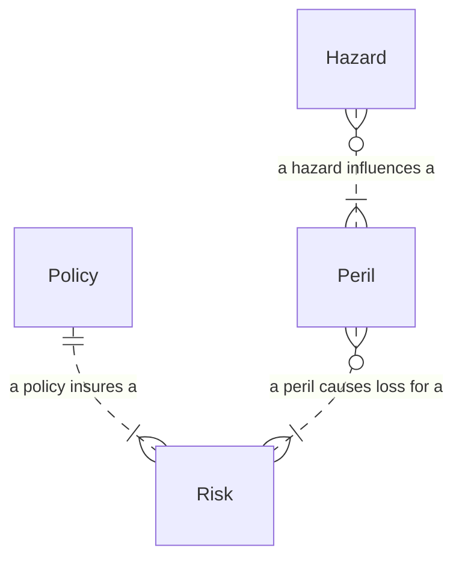

# Models

## Risks

```mermaid
erDiagram
    Policy 
    Risk 
    Peril
    Hazard
    Policy ||..|{ Risk : "a policy insures a"
    Peril }o..|{ Risk : "a peril causes loss for a"
    Hazard }o..|{ Peril : "a hazard influences a"
```

