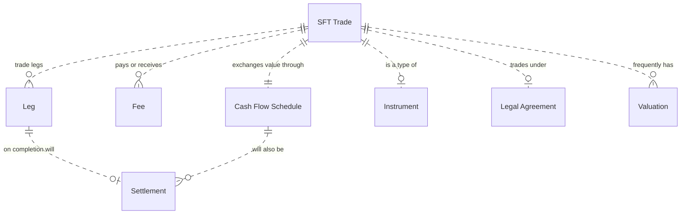

# Securities Financing Transactions
SFT transactions are most commonly used to:  
1. Use one or more of your securities to borrow cash from a counterparty
2. Use one or more of your securities to borrow a different security you need from a counterparty
3. Use your cash to borrow a security you need from a counterparty

Instead of using securities, banks can also use commodities.   

Also, instead of borrowing a security they can also sell and buy-back (or visa-versa).  The only differences are in the legal & beneficial ownership, and accruing rights of the securities or commodities during the SFT duration.

Banks enter into an SFT for various purposes, but mostly for relatively short term cash managment.   

These are more formally categorised and described in the [EU regulation 2365 - Article 3](https://eur-lex.europa.eu/eli/reg/2015/2365/oj).  

A master agreement is usually entered into (e.g. for a year) by two counterparties, which then enables the specified types of SFT trades to be undertaken between them, usually within certain financial and/or volume limits.

## Data Model
  

