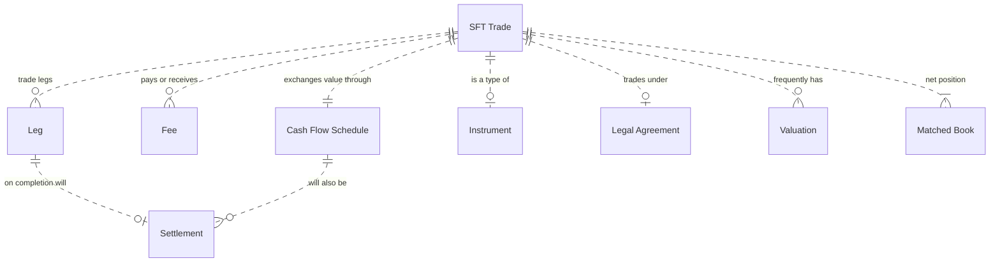

# Securities Financing Transactions
SFT transactions are most commonly used to:  
1. Use one or more of your securities to borrow cash from a counterparty
2. Use one or more of your securities to borrow a different security you need from a counterparty
3. Use your cash to borrow a security you need from a counterparty

Instead of using securities, banks can also use commodities.   

Also, instead of borrowing a security they can also sell and buy-back (or visa-versa).  The only differences are in the legal & beneficial ownership, and accruing rights of the securities or commodities during the SFT duration.

### SFT Background
Banks enter into an SFT for various purposes, but mostly for relatively short term cash managment.   

The types of transactions are more formally categorised and described in the [EU regulation 2365 - Article 3](https://eur-lex.europa.eu/eli/reg/2015/2365/oj).  

In order to undertake any SFT, a master agreement is usually entered into between two counterparties, which then enables the specified types of SFT trades to be undertaken between them, usually within certain financial and/or volume limits.

## Data Model
  

### Trade
An individual transaction between two counterparties.  The trade identifies the financial instrument being exchanged, the product type and sub-tyes, the legal entities (counterparties), effective & maturity dates, time duration of the SFT, other flags or indicators and sometimes the trader or trading desk identifiers.  

### Leg
Each portion of the trade.  For example, in a Repo there are 2 legs.  One for the security and the other for the cash.  The leg contains all the data items specific to the portion for that particular trade.  

### Fee 
These are usually the gain made by the SFT.  Amongst others, a fee can be a rebate when lending cash, a lending fee when lending a security, the interest received on the cash portion of a Repo. 

### Cash Flow Schedule  
Represents all (both past and future) periodic payments for the dividends, coupons or interest rate payments associated to SFT securities or collateral related to the trade.  

### Settlement  

### Matched Book 
The matched book contains all SFT trade positions.  When all positions are closed this will net to zero. When the matched book does not net to zero it indicates there are open positions with active securities, which in reality will be most of the time.  

### Instrument

### Legal Agreement  

### Valuation 
A valuation is what determines the current value of an asset.  Types of valuation methods are public market, standard models, and custom models.  
