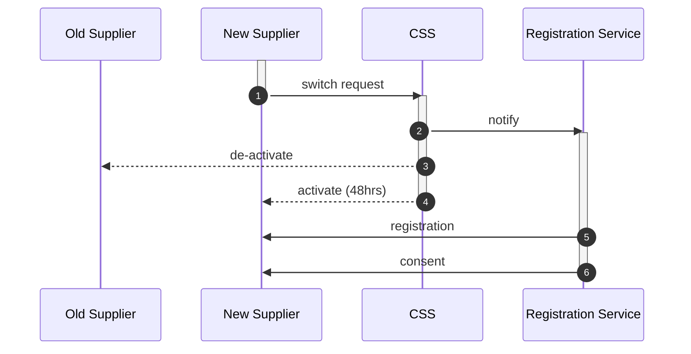

## Change of Supplier (CoS)
Where a customer (retail or business), for economic or service reasons, wants to move to another electricity supplier.  In this case, their metering operations must be closed down at one supplier and opened at a new supplier.   

### Data Flows
The Central Switching Service design documentation is [listed at Ofgem](https://www.ofgem.gov.uk/publications/css-design-and-delivery-products) along with the [end-to-end design products](https://www.ofgem.gov.uk/publications/e2e-design-products).    

|Sequence |Flow |Definition |
|:-|:-|:-|
|1 |CSS1800 ||
