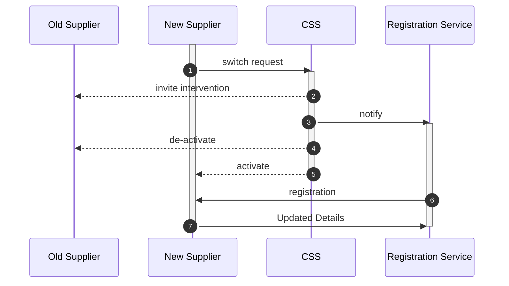

## Change of Supplier (CoS)
### MHHS Target State
Where a customer (retail or business), for economic or service reasons, wants to move to another electricity supplier.  In this case, their metering operations must be closed down at one supplier and opened at a new supplier.   

### Data Flows
The CSS specific data flows are newly defined and are both the current and target state market messages.  The D-Flows are current state only, and will be replaced by the new events which will be implemented by MHHS.  These legacy flows are provided to give context to the new message types.     

| |Flow |Name |Definition |
|:-|:-|:-|:-|
|1 |CSS 1800 |Switch Request (Gaining Supplier) |The supply start date, MPID of the meter, etc. |
|2 |CSS 2700 |Invitation to Inetervene (Losing Supplier) |In case of an error by the gaining supplier. |
|3 |CSS 2800 |Registration Pending Synchronization |Notify the Registration service of the  change. |
|4 |CSS 2370 |Registration Secured Inactive (Losing Supplier) |The current registered supplier is notified of the de-activation. |
|5 |CSS 2370 |Registration Secured Active (Gaining Supplier) |The new supplier is confirmed. |
|6 |D0217 |Metering Point Registration Confirmation |The Registration Service also confirms the new Supplier. |
|7 |D0205 |Update Registration Details |The new Supplier provides updated information to the Registration Service.  After this, the new Supplier will appoint agents such as MOPs and DCs, etc. |

