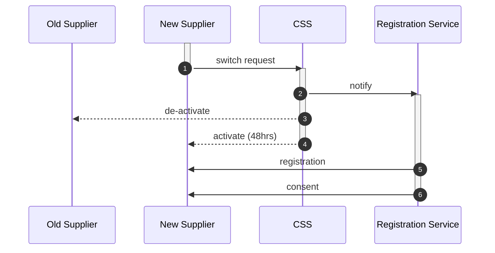

# MHHS
The UK energy industry contains several essential roles and functions which must be undertaken in order for the regulated market of electricity supply and demand to work effectively.  
Market wide half-hourly settlement (MHHS) is an industry initiative to allow:  
- the circa. 32 million smart meters to provide faster data integration with energy market participants and settlement IT systems  
- simplification of interfaces and communications between market participants  

## Change of Supplier (CoS)
Where a customer (retail or business), for economic or service reasons, wants to move to another electricity supplier.  In this case, their metering operations must be closed down at one supplier and opened at a new supplier.   

## Data Flows
